# Architecture Document — Myntra Wishlist Conversion System

> Derived from [problem-statement.md](file:///d:/DRIVE%20F/GRAD%20PROJECT%20NL/docs/problem-statement.md)  
> **Two independent codebases** — deployed and operated separately.

---

## Table of Contents

- [1. System Overview](#1-system-overview)
- [2. Part A — Discovery Engine Architecture](#2-part-a--discovery-engine-architecture)
  - [2.1 High-Level Architecture](#21-high-level-architecture)
  - [2.2 Ingestion Layer](#22-ingestion-layer)
  - [2.3 Preprocessing Layer](#23-preprocessing-layer)
  - [2.4 LLM Classification Layer](#24-llm-classification-layer)
  - [2.5 Aggregation Layer](#25-aggregation-layer)
  - [2.6 API Layer](#26-api-layer)
  - [2.7 Dashboard (Frontend)](#27-dashboard-frontend)
  - [2.8 Data Model](#28-data-model)
  - [2.9 Directory Structure](#29-directory-structure)
- [3. Part B — MVP Architecture](#3-part-b--mvp-architecture)
  - [3.1 High-Level Architecture](#31-high-level-architecture)
  - [3.2 Backend Services](#32-backend-services)
  - [3.3 Module System](#33-module-system)
  - [3.4 Frontend Architecture](#34-frontend-architecture)
  - [3.5 Instrumentation & Event Logging](#35-instrumentation--event-logging)
  - [3.6 Data Model](#36-data-model)
  - [3.7 Directory Structure](#37-directory-structure)
- [4. Cross-System Data Flow](#4-cross-system-data-flow)
- [5. Technology Stack Summary](#5-technology-stack-summary)
- [6. Deployment Architecture](#6-deployment-architecture)
- [7. Security & Constraints](#7-security--constraints)
- [8. Error Handling & Resilience](#8-error-handling--resilience)

---

## 1. System Overview

The system is split into two **independent, self-contained applications** that share a one-way data dependency: Part A's output feeds into Part B's backend as a review corpus.

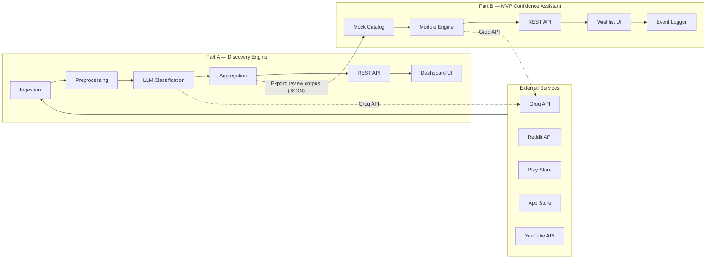

> [!NOTE]
> The only data bridge between the two systems is a **static JSON export** of the review corpus from Part A's aggregation layer, consumed by Part B's mock catalog. There is no runtime dependency between them.

---

## 2. Part A — Discovery Engine Architecture

### 2.1 High-Level Architecture

```mermaid
flowchart TD
    subgraph Sources["Data Sources"]
        S1["Reddit API / PRAW"]
        S2["google-play-scraper"]
        S3["app-store-scraper"]
        S4["YouTube Data API"]
        S5["Twitter/X API"]
        S6["Forum Scrapers"]
    end

    subgraph Ingestion["Ingestion Layer (Pipedream)"]
        I1["Scheduled Triggers"]
        I2["Data Fetch Steps (Native & Node.js)"]
        I3["Supabase Insert Row"]
    end

    subgraph Preprocessing["Preprocessing Layer"]
        P1["Deduplication (hash-based)"]
        P2["Language detection & filter"]
        P3["Noise removal (ads, spam, bots)"]
        P4["Text normalization"]
    end

    subgraph Classification["LLM Classification Layer"]
        C1["Prompt builder"]
        C2["Groq API client"]
        C3["Response parser & validator"]
        C4["Taxonomy registry"]
    end

    subgraph Aggregation["Aggregation Layer"]
        A1["Frequency counter"]
        A2["Intensity averager"]
        A3["Co-occurrence matrix builder"]
        A4["Opportunity scorer"]
        A5["Export generator (JSON/CSV)"]
    end

    subgraph API["API Layer (FastAPI)"]
        R1["GET /api/classify"]
        R2["GET /api/dashboard/drivers"]
        R3["GET /api/dashboard/cooccurrence"]
        R4["GET /api/dashboard/opportunities"]
        R5["GET /api/export"]
    end

    subgraph Dashboard["Dashboard (React)"]
        D1["Live Classifier Demo"]
        D2["Driver Frequency Chart"]
        D3["Co-occurrence Heatmap"]
        D4["Opportunity Table"]
        D5["Segment Filter"]
    end

    Sources --> Ingestion --> Preprocessing --> Classification --> Aggregation --> API --> Dashboard
    Classification -.->|HTTP| GROQ["Groq API"]
```

---

### 2.2 Ingestion Layer (Pipedream)

Data ingestion is handled autonomously by **Pipedream** workflows, which fetch user reviews and comments on a schedule and insert them directly into Supabase.

#### Workflow Architecture

Each data source is configured as a separate Pipedream workflow or a distinct step within a unified workflow.

| Source | Pipedream Implementation | Key Fields Extracted | Rate Limiting |
|---|---|---|---|
| Reddit | Native Pipedream Reddit App | post title, body, comments, subreddit, score, timestamp | Handled by Pipedream natively |
| YouTube | Native Pipedream YouTube Data API App | comment text, like count, video title, publish date | Handled by Pipedream natively |
| Google Play Store | Node.js code step using `google-play-scraper` | review text, rating, date, thumbs-up count | Built-in delays |
| Apple App Store | Node.js code step using `app-store-scraper` | review text, rating, date, title | Built-in delays |
| Twitter / X | Native Pipedream Twitter/X App | tweet text, like/retweet count, date | Handled by Pipedream natively |

#### Pipedream to Supabase Integration
Pipedream uses its native **Supabase (Insert Row)** action to map the extracted fields into the `raw_snippets` table seamlessly.

#### Raw Snippet Schema

```json
{
  "id": "uuid",
  "source": "reddit | playstore | appstore | youtube | twitter | forum",
  "text": "original comment or review text",
  "metadata": {
    "author_id": "anonymized or null",
    "timestamp": "ISO 8601",
    "engagement": {
      "score": 42,
      "rating": 4
    },
    "source_url": "permalink",
    "subreddit": "IndianFashionAddicts",
    "video_title": "Myntra Haul 2026"
  },
  "scraped_at": "ISO 8601"
}
```

---

### 2.3 Preprocessing Layer

A sequential pipeline that cleans raw snippets before classification.

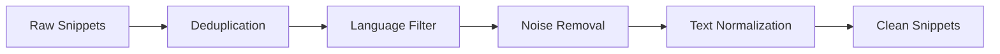

| Step | Logic | Implementation Notes |
|---|---|---|
| **Deduplication** | SHA-256 hash of normalized text; reject exact and near-duplicates | Use `simhash` or `MinHash` for fuzzy dedup if scale warrants |
| **Language Filter** | Keep English and Hindi (transliterated) snippets | `langdetect` or `fasttext` language ID |
| **Noise Removal** | Drop spam, bot-generated content, ads, and very short snippets (< 15 chars) | Regex patterns + heuristic length/content filters |
| **Text Normalization** | Lowercase, strip excess whitespace, normalize Unicode | Standard text preprocessing |

---

### 2.4 LLM Classification Layer

The core intelligence of the Discovery Engine — each clean snippet is sent to the Groq API for structured classification.

#### Prompt Architecture

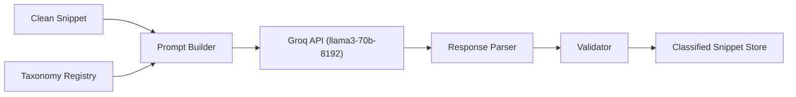

#### Prompt Template (Simplified)

```
System: You are a fashion e-commerce analyst. Classify the following user
comment against the provided taxonomy of purchase hesitation drivers.

Taxonomy:
1. Fit / Size Uncertainty
2. Price / Deal-Timing Uncertainty
3. Styling / Occasion Uncertainty
... (full taxonomy injected here)

Instructions:
- Assign ONE OR MORE taxonomy tags (multi-label).
- Provide a short paraphrased summary (do NOT quote verbatim).
- Rate intensity on a 1–5 scale (how strongly does this express the driver).
- Flag any user segment signals (e.g., student, first-time buyer, plus-size).
- If the snippet doesn't fit any category, propose a new one with reasoning.

Respond in JSON:
{
  "tags": [...],
  "paraphrase": "...",
  "intensity": N,
  "segments": [...],
  "new_category": null | { "name": "...", "reasoning": "..." }
}

User comment: "<snippet_text>"
```

#### Classification Output Schema

```json
{
  "snippet_id": "uuid (FK to raw snippet)",
  "tags": ["fit_size_uncertainty", "return_exchange_fear"],
  "paraphrase": "User is hesitant because they're unsure about sizing and worried returns will be difficult",
  "intensity": 4,
  "segments": ["first-time buyer"],
  "new_category": null,
  "model": "llama3-70b-8192",
  "confidence": 0.92,
  "classified_at": "ISO 8601"
}
```

#### Groq API Integration

| Config | Value |
|---|---|
| **Model** | `llama3-70b-8192` (or latest available) |
| **Temperature** | `0.1` (low variance for consistent classification) |
| **Max Tokens** | `512` (structured JSON output) |
| **Rate Limiting** | Respect Groq's requests-per-minute limits; implement exponential backoff |
| **Batch Strategy** | Process snippets sequentially or in small batches; log failures for retry |

---

### 2.5 Aggregation Layer

Transforms individual classification results into actionable, ranked insights.

#### Computation Pipeline

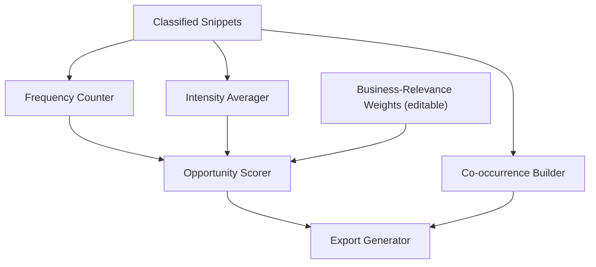

#### Opportunity Score Formula

```
opportunity_score = frequency × avg_intensity × business_relevance_weight
```

| Component | Source | Default |
|---|---|---|
| `frequency` | Count of snippets tagged with this driver | Computed |
| `avg_intensity` | Mean intensity score (1–5) across tagged snippets | Computed |
| `business_relevance_weight` | Editable multiplier per driver (stored in config) | `1.0` for all drivers |

#### Co-occurrence Matrix

A symmetric N×N matrix where `matrix[i][j]` = count of snippets tagged with **both** driver `i` and driver `j`. Used to surface compound blockers (e.g., "fit uncertainty" + "return fear" often co-occur).

#### Aggregated Output Schema

```json
{
  "generated_at": "ISO 8601",
  "total_snippets_processed": 847,
  "drivers": [
    {
      "id": "fit_size_uncertainty",
      "label": "Fit / Size Uncertainty",
      "frequency": 142,
      "avg_intensity": 4.1,
      "business_relevance_weight": 1.2,
      "opportunity_score": 87.3,
      "example_paraphrases": [
        "Unsure about sizing for this brand",
        "Worried the fit won't match expectations",
        "Between two sizes with no way to know which is right"
      ],
      "top_segments": ["first-time buyer", "plus-size"]
    }
  ],
  "cooccurrence_matrix": {
    "fit_size_uncertainty": {
      "return_exchange_fear": 38,
      "trust_review_doubt": 22
    }
  }
}
```

---

### 2.6 API Layer

RESTful API built with **Python (FastAPI)**. Serves both the dashboard frontend and the live classifier demo.

#### Endpoint Specification

| Method | Endpoint | Purpose | Request | Response |
|---|---|---|---|---|
| `POST` | `/api/classify` | Live classifier demo — classify arbitrary text | `{ "text": "..." }` | Classification result (tags, paraphrase, intensity, segments) |
| `GET` | `/api/dashboard/drivers` | Driver frequency & intensity data | Query: `?segment=student` (optional) | Array of driver objects with frequency, intensity, score |
| `GET` | `/api/dashboard/cooccurrence` | Co-occurrence matrix | — | N×N matrix as nested object |
| `GET` | `/api/dashboard/opportunities` | Ranked opportunity table | Query: `?limit=10` | Sorted drivers with example paraphrases |
| `GET` | `/api/export` | Full data export | Query: `?format=json|csv` | Complete aggregated dataset |
| `GET` | `/api/taxonomy` | Current taxonomy listing | — | Array of driver categories |
| `PUT` | `/api/weights` | Update business-relevance weights | `{ "driver_id": weight }` | Updated weights + recalculated scores |
| `GET` | `/api/health` | Health check | — | `{ "status": "ok" }` |

#### API Architecture

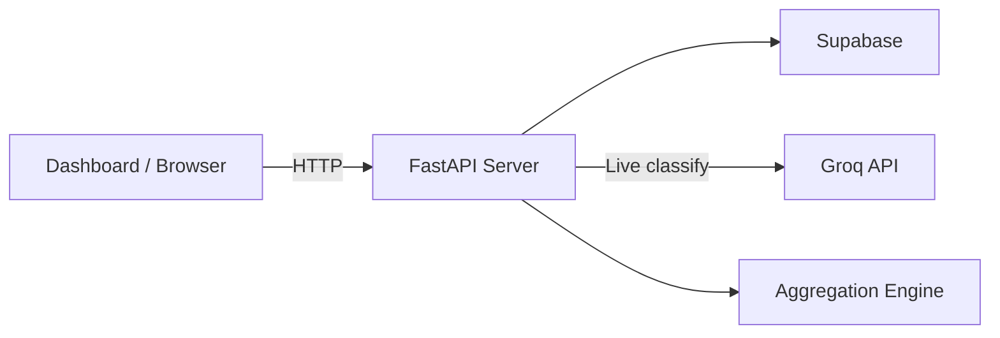

---

### 2.7 Dashboard (Frontend)

Single-page React application with two primary views.

#### Component Tree

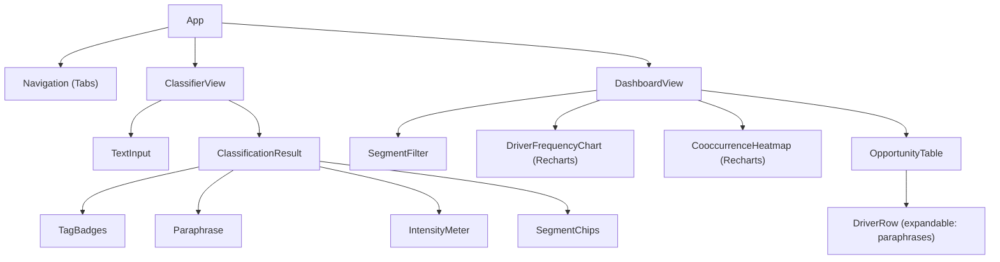

| View | Key Components | Data Source |
|---|---|---|
| **Live Classifier** | `TextInput`, `ClassificationResult`, `TagBadges`, `IntensityMeter` | `POST /api/classify` |
| **Findings Dashboard** | `DriverFrequencyChart`, `CooccurrenceHeatmap`, `OpportunityTable`, `SegmentFilter` | `GET /api/dashboard/*` |

---

### 2.8 Data Model

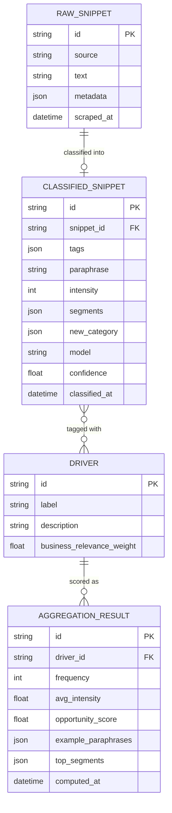

**Storage:** Supabase (PostgreSQL database).

| Table | Purpose | Approx. Row Count |
|---|---|---|
| `raw_snippets` | All scraped text before processing | Hundreds to low thousands |
| `classified_snippets` | LLM classification results per snippet | Same as raw (1:1) |
| `drivers` | Taxonomy of hesitation drivers | 10–15 rows |
| `aggregation_results` | Pre-computed aggregated metrics | 10–15 rows (one per driver) |

---

### 2.9 Directory Structure

```
/discovery-engine
│
├── /ingestion                     # Note: Data collection is handled by Pipedream
│   └── pipedream_config.md        # Reference to public Pipedream workflow URLs
│
├── /preprocessing                 # Text cleaning pipeline
│   ├── pipeline.py                # Orchestrates dedup → lang → noise → normalize
│   ├── dedup.py                   # Hash-based deduplication
│   ├── language_filter.py         # Language detection & filtering
│   └── noise_removal.py           # Spam/bot/ad removal
│
├── /classification                # LLM-powered analysis
│   ├── classifier.py              # Main classification orchestrator
│   ├── groq_client.py             # Groq API wrapper (rate limiting, retries)
│   ├── prompt_builder.py          # Prompt template construction
│   ├── response_parser.py         # JSON response parsing & validation
│   └── taxonomy.json              # Driver taxonomy configuration
│
├── /aggregation                   # Statistical computation
│   ├── aggregator.py              # Frequency, intensity, co-occurrence
│   ├── opportunity_scorer.py      # Opportunity score calculation
│   ├── exporter.py                # JSON/CSV export generation
│   └── weights_config.json        # Editable business-relevance weights
│
├── /api                           # REST API server
│   ├── main.py                    # FastAPI app entry point
│   ├── routes/
│   │   ├── classify.py            # POST /api/classify
│   │   ├── dashboard.py           # GET /api/dashboard/*
│   │   ├── export.py              # GET /api/export
│   │   └── health.py              # GET /api/health
│   └── models.py                  # Pydantic request/response schemas
│
├── /dashboard                     # React frontend
│   ├── /src
│   │   ├── App.jsx                # Root component with tab navigation
│   │   ├── /views
│   │   │   ├── ClassifierView.jsx # Live classifier demo
│   │   │   └── DashboardView.jsx  # Findings dashboard
│   │   ├── /components
│   │   │   ├── TextInput.jsx
│   │   │   ├── ClassificationResult.jsx
│   │   │   ├── DriverFrequencyChart.jsx
│   │   │   ├── CooccurrenceHeatmap.jsx
│   │   │   ├── OpportunityTable.jsx
│   │   │   └── SegmentFilter.jsx
│   │   └── /services
│   │       └── api.js             # Axios/fetch wrapper for API calls
│   ├── package.json
│   └── vite.config.js
│
├── /db
│   └── supabase_client.py         # Supabase client setup
│
├── requirements.txt               # Python dependencies
├── .env.example                   # Environment variable template
└── README.md
```

---

## 3. Part B — MVP Architecture

### 3.1 High-Level Architecture

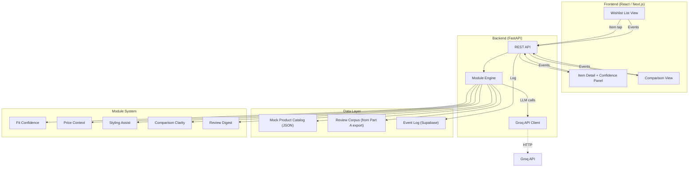

---

### 3.2 Backend Services

#### Endpoint Specification

| Method | Endpoint | Purpose | Request | Response |
|---|---|---|---|---|
| `GET` | `/api/wishlist` | Get all wishlisted items | — | Array of product objects |
| `GET` | `/api/wishlist/:itemId` | Get single item with details | — | Product object with full metadata |
| `POST` | `/api/modules/:itemId` | Get confidence modules for an item | `{ "modules": ["fit", "price", ...] }` | Module results (generated via LLM) |
| `POST` | `/api/compare` | Compare 2+ wishlisted items | `{ "item_ids": ["id1", "id2"] }` | Side-by-side comparison data |
| `POST` | `/api/events` | Log an instrumentation event | `{ "event": "module_opened", "data": {...} }` | `{ "status": "logged" }` |
| `GET` | `/api/events/summary` | Get event analytics summary | Query: `?days=30` | Aggregated event counts |
| `GET` | `/api/health` | Health check | — | `{ "status": "ok" }` |

---

### 3.3 Module System

Each module is a **self-contained unit** that can be independently enabled/disabled via configuration. All modules share a common interface.

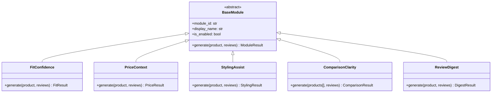

#### Module Details

| Module | LLM Input | LLM Output | Data Dependencies |
|---|---|---|---|
| **Fit Confidence** | Product sizing info + review excerpts mentioning fit/size | Predicted fit summary (e.g., "runs small for M based on 23 reviews") | Product metadata, review corpus |
| **Price Context** | Price history data points | Trend narrative (e.g., "stable for 60 days, typically drops during EOSS") | Mock price history |
| **Styling Assist** | Product category, color, material + wardrobe basics | 2–3 outfit pairing suggestions with occasion context | Product metadata |
| **Comparison Clarity** | Attributes of 2+ similar wishlisted items | Key differences highlighted (material, price, rating, fit) | Product catalog |
| **Review Digest** | Filtered reviews matching user concern signals | Synthesized summary of real experiences | Review corpus |

> [!IMPORTANT]
> **Price Context** must remain purely informational — no "buy now before price goes up" framing. Present data neutrally.

---

### 3.4 Frontend Architecture

#### Page / Component Hierarchy

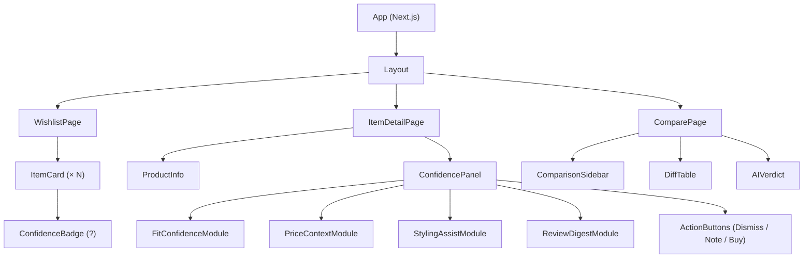

#### Screen Specifications

| Screen | Route | Key Interactions |
|---|---|---|
| **Wishlist List** | `/` | View all wishlisted items; tap `?` badge on any item to navigate to detail |
| **Item Detail** | `/item/:id` | View product info + confidence panel with relevant modules; dismiss, save note, or proceed to purchase |
| **Comparison** | `/compare?items=id1,id2` | Side-by-side comparison of 2+ similar wishlisted items with AI-generated key differences |

---

### 3.5 Instrumentation & Event Logging

Every user interaction with the confidence system is logged for later analysis.

#### Event Schema

```json
{
  "event_id": "uuid",
  "event_type": "module_opened | module_type | item_purchased | item_removed",
  "timestamp": "ISO 8601",
  "data": {
    "item_id": "SKU-001",
    "module_type": "fit_confidence",
    "session_id": "anonymous-session-uuid",
    "time_spent_ms": 4500
  }
}
```

#### Event Flow

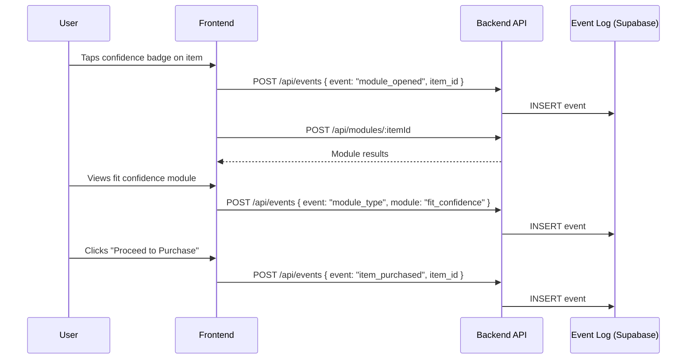

---

### 3.6 Data Model

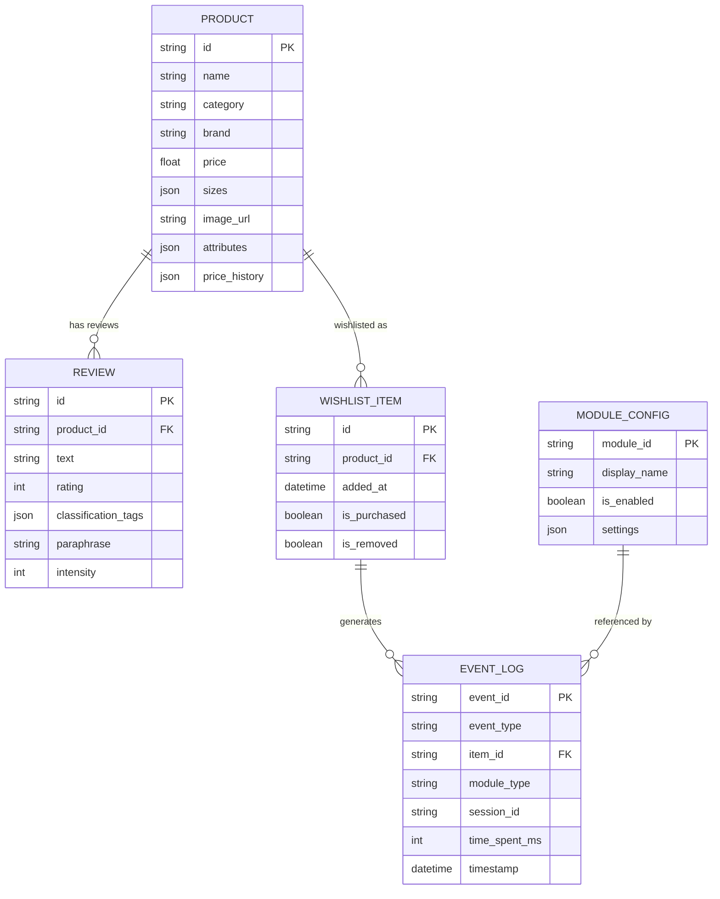

**Storage:** Supabase + JSON files for mock catalog.

| Store | Format | Contents |
|---|---|---|
| `mock_catalog.json` | JSON | 10–20 sample SKUs with realistic product data |
| `review_corpus.json` | JSON | Exported review data from Part A |
| `event_log` table | Supabase | Instrumentation event log |
| `module_config.json` | JSON | Toggle flags and settings for each module |

---

### 3.7 Directory Structure

```
/mvp
│
├── /frontend                          # Next.js application
│   ├── /src
│   │   ├── /app                       # Next.js app router
│   │   │   ├── layout.jsx             # Root layout (Myntra-style shell)
│   │   │   ├── page.jsx               # Wishlist list view (home)
│   │   │   ├── /item
│   │   │   │   └── [id]/page.jsx      # Item detail + confidence panel
│   │   │   └── /compare
│   │   │       └── page.jsx           # Comparison view
│   │   ├── /components
│   │   │   ├── ItemCard.jsx
│   │   │   ├── ConfidenceBadge.jsx
│   │   │   ├── ConfidencePanel.jsx
│   │   │   ├── FitConfidenceModule.jsx
│   │   │   ├── PriceContextModule.jsx
│   │   │   ├── StylingAssistModule.jsx
│   │   │   ├── ComparisonClarity.jsx
│   │   │   ├── ReviewDigestModule.jsx
│   │   │   └── ActionButtons.jsx
│   │   ├── /services
│   │   │   ├── api.js                 # Backend API client
│   │   │   └── events.js              # Event logging helper
│   │   └── /styles
│   │       └── globals.css
│   ├── package.json
│   └── next.config.js
│
├── /backend                           # FastAPI application
│   ├── main.py                        # App entry point
│   ├── /routes
│   │   ├── wishlist.py                # Wishlist CRUD endpoints
│   │   ├── modules.py                 # Module generation endpoints
│   │   ├── compare.py                 # Comparison endpoint
│   │   ├── events.py                  # Event logging endpoints
│   │   └── health.py                  # Health check
│   ├── /modules                       # Module engine
│   │   ├── base_module.py             # Abstract module interface
│   │   ├── fit_confidence.py
│   │   ├── price_context.py
│   │   ├── styling_assist.py
│   │   ├── comparison_clarity.py
│   │   ├── review_digest.py
│   │   └── module_registry.py         # Module discovery & toggle
│   ├── /services
│   │   ├── groq_client.py             # Groq API wrapper
│   │   └── catalog_service.py         # Mock catalog data access
│   ├── models.py                      # Pydantic schemas
│   └── config.py                      # Environment & module config
│
├── /mock-data                         # Sample data
│   ├── catalog.json                   # 10–20 mock SKUs
│   ├── review_corpus.json             # Imported from Part A
│   ├── price_history.json             # Synthetic price trends
│   └── module_config.json             # Module toggle flags
│
├── /db
│   └── supabase_client.py             # Supabase client setup
│
├── requirements.txt                   # Python dependencies
├── .env.example
└── README.md
```

---

## 4. Cross-System Data Flow

The only runtime dependency between Part A and Part B is a **one-time static export**.

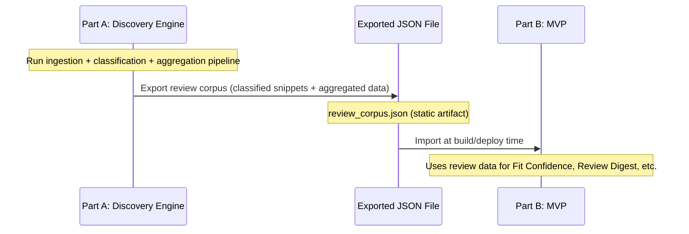

#### Exported Data Contract

Part A exports, Part B consumes:

```json
{
  "export_version": "1.0",
  "exported_at": "ISO 8601",
  "snippets": [
    {
      "id": "...",
      "source": "reddit",
      "tags": ["fit_size_uncertainty"],
      "paraphrase": "...",
      "intensity": 4,
      "segments": ["plus-size"],
      "product_signals": ["kurta", "M size"]
    }
  ],
  "aggregated_drivers": [
    {
      "id": "fit_size_uncertainty",
      "frequency": 142,
      "avg_intensity": 4.1,
      "opportunity_score": 87.3
    }
  ]
}
```

---

## 5. Technology Stack Summary

| Layer | Part A (Discovery Engine) | Part B (MVP) |
|---|---|---|
| **Language** | Python 3.11+ | Python 3.11+ (backend), JavaScript/JSX (frontend) |
| **Backend Framework** | FastAPI | FastAPI |
| **Frontend Framework** | React (Vite) | Next.js |
| **LLM Provider** | Groq API (`llama3-70b-8192`) | Groq API (`llama3-70b-8192`) |
| **Charting** | Recharts / Chart.js | — |
| **Database** | Supabase | Supabase (event log) |
| **Data Format** | JSON / CSV exports | JSON (mock catalog, review corpus) |
| **HTTP Client** | `httpx` / `requests` | `httpx` |
| **Scraping** | Pipedream (Node.js/Native Apps) | — |
| **Deployment** | Vercel / Railway / Replit | Vercel / Replit |

### Key Dependencies

#### Part A — Python

```
fastapi
uvicorn
praw
google-play-scraper
app-store-scraper
httpx
langdetect
supabase
python-dotenv
```

#### Part A — Frontend (Node.js)

```
react
react-dom
recharts
axios
vite
```

#### Part B — Python

```
fastapi
uvicorn
httpx
supabase
python-dotenv
```

#### Part B — Frontend (Node.js)

```
next
react
react-dom
```

---

## 6. Deployment Architecture

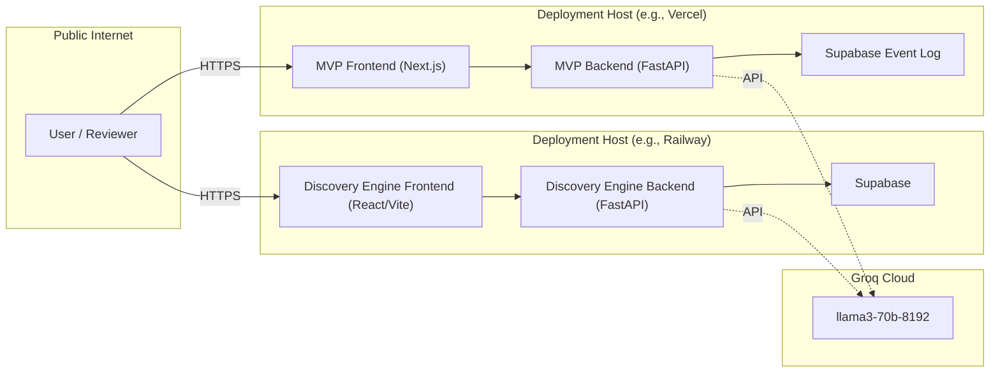

#### Deployment Requirements

| Requirement | Detail |
|---|---|
| **Public URL** | Both apps must be accessible via public URLs — no login wall |
| **HTTPS** | All traffic over HTTPS (provided by platform) |
| **Environment Variables** | `GROQ_API_KEY`, API keys for scrapers — stored as platform secrets |
| **No Auth Wall** | Reviewers / evaluators must access without creating accounts |
| **CORS** | Backend must allow requests from the frontend origin |

---

## 7. Security & Constraints

### Environment Variables

| Variable | Used By | Purpose |
|---|---|---|
| `GROQ_API_KEY` | Both | Authenticate with Groq LLM API |
| `REDDIT_CLIENT_ID` | Part A | Reddit OAuth app credentials |
| `REDDIT_CLIENT_SECRET` | Part A | Reddit OAuth app credentials |
| `YOUTUBE_API_KEY` | Part A | YouTube Data API access |
| `TWITTER_BEARER_TOKEN` | Part A | Twitter API v2 authentication |

### Hard Constraints (Enforced in Code)

> [!CAUTION]
> These constraints must be enforced at the **module level**, not just the UI level.

| Constraint | Enforcement |
|---|---|
| No monetary incentives | Price Context module must never generate language framing price data as a discount or incentive. Prompt instructions explicitly prohibit this. |
| No dark patterns | No fake urgency timers, no "only X left in stock" signals, no manipulative language in any module output. |
| Informational only | All module outputs must be framed as neutral information to aid decision-making. |

---

## 8. Error Handling & Resilience

### Groq API Failures

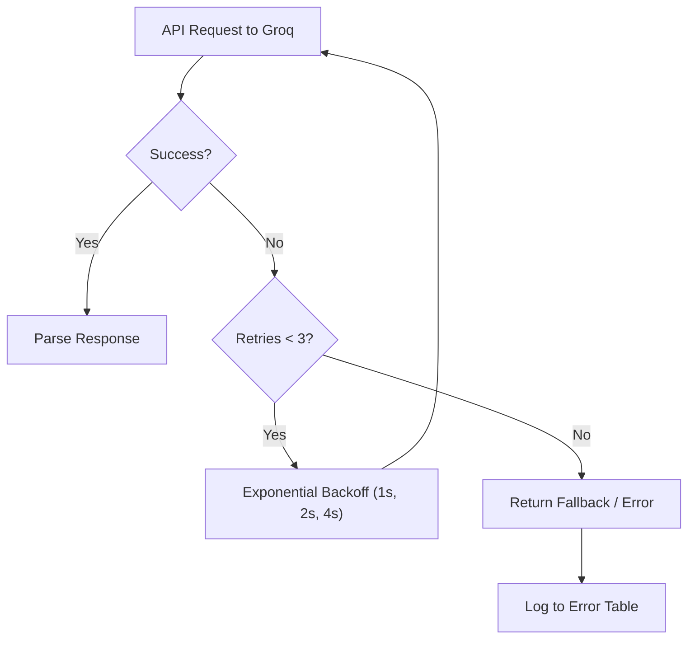

| Failure Mode | Strategy |
|---|---|
| **Groq API timeout** | 3 retries with exponential backoff (1s → 2s → 4s) |
| **Groq rate limit (429)** | Respect `Retry-After` header; queue and retry |
| **Malformed LLM response** | Validate JSON schema; re-prompt once; log and skip on second failure |
| **Scraper failure** | Log error; continue with remaining sources; surface partial data |
| **Database write failure** | Retry once; log to stderr; surface error in API response |
| **Frontend API failure** | Show user-friendly error state in UI; retry button |

### Logging

| Layer | Log Target | Level |
|---|---|---|
| Scrapers | `logs/ingestion.log` | INFO (success), ERROR (failures) |
| Classification | `logs/classification.log` | INFO (classified), WARN (fallback), ERROR (failed) |
| API | stdout (platform captures) | INFO (requests), ERROR (failures) |
| Events | Supabase `event_log` table | All events logged |

---

*Source: [problem-statement.md](file:///d:/DRIVE%20F/GRAD%20PROJECT%20NL/docs/problem-statement.md)*
