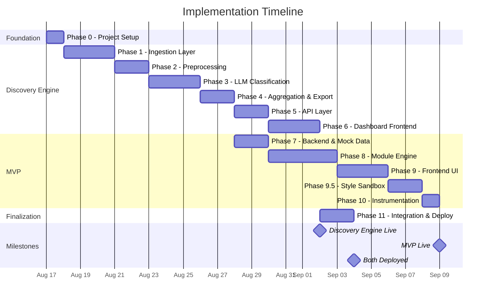
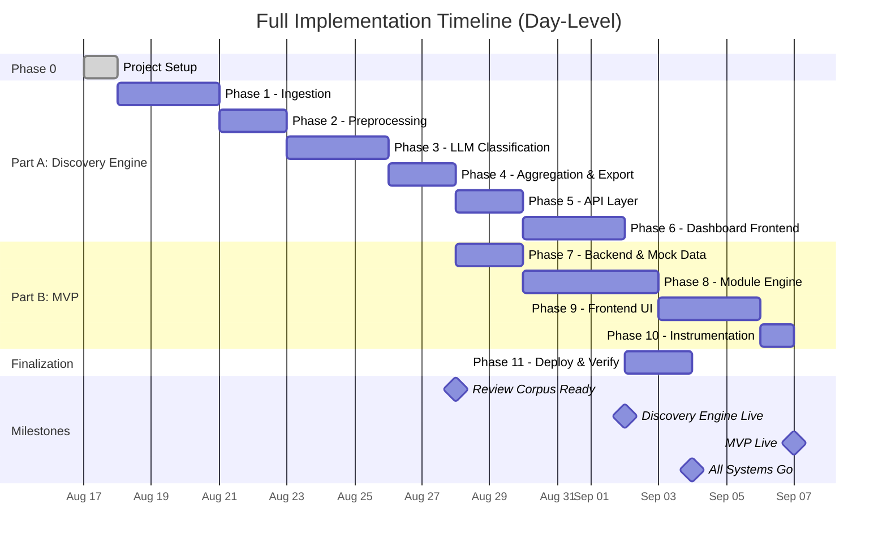

# Implementation Plan — Myntra Wishlist Conversion System

> Derived from [problem-statement.md](file:///d:/DRIVE%20F/GRAD%20PROJECT%20NL/docs/problem-statement.md) and [architecture.md](file:///d:/DRIVE%20F/GRAD%20PROJECT%20NL/docs/architecture.md)

---

## Table of Contents

- [Overview](#overview)
- [Phase 0 — Project Setup & Foundation](#phase-0--project-setup--foundation)
- [Phase 1 — Discovery Engine: Ingestion Layer](#phase-1--discovery-engine-ingestion-layer)
- [Phase 2 — Discovery Engine: Preprocessing Pipeline](#phase-2--discovery-engine-preprocessing-pipeline)
- [Phase 3 — Discovery Engine: LLM Classification](#phase-3--discovery-engine-llm-classification)
- [Phase 4 — Discovery Engine: Aggregation & Export](#phase-4--discovery-engine-aggregation--export)
- [Phase 5 — Discovery Engine: API Layer](#phase-5--discovery-engine-api-layer)
- [Phase 6 — Discovery Engine: Dashboard Frontend](#phase-6--discovery-engine-dashboard-frontend)
- [Phase 7 — MVP: Backend Foundation & Mock Data](#phase-7--mvp-backend-foundation--mock-data)
- [Phase 8 — MVP: Module Engine & Core Modules](#phase-8--mvp-module-engine--core-modules)
- [Phase 9 — MVP: Frontend (Wishlist UI)](#phase-9--mvp-frontend-wishlist-ui)
- [Phase 9.5 — MVP: The Style Sandbox (Drag & Drop)](#phase-95--mvp-the-style-sandbox-drag--drop)
- [Phase 10 — MVP: Instrumentation & Event Logging](#phase-10--mvp-instrumentation--event-logging)
- [Phase 11 — Integration, Polish & Deployment](#phase-11--integration-polish--deployment)
- [Timeline Summary](#timeline-summary)
- [Risk Register](#risk-register)
- [Definition of Done Checklist](#definition-of-done-checklist)

---

## Overview

### Execution Strategy

The two codebases are built **sequentially**, starting with the Discovery Engine (Part A), because:
1. Part A's **review corpus export** is a data dependency for Part B's modules (Fit Confidence, Review Digest).
2. Part A's classification pipeline establishes the Groq API integration pattern reused in Part B.
3. Part A's aggregated insights inform which MVP modules are most valuable to build first.



> [!NOTE]
> **Phase 7 starts in parallel with Phase 5–6.** Once the aggregation layer (Phase 4) produces the review corpus export, MVP backend work can begin while the Discovery Engine dashboard is still being built.

### Estimated Effort

| Codebase | Phases | Estimated Days |
|---|---|---|
| Foundation | Phase 0 | 1 day |
| Discovery Engine | Phases 1–6 | 15 days |
| MVP | Phases 7–10 | 10 days |
| Finalization | Phase 11 | 2 days |
| **Total** | | **~28 days** |

---

## Phase 0 — Project Setup & Foundation

**Goal:** Establish repository structure, development environment, and shared configuration for both projects.

**Duration:** 1 day

---

### Tasks

#### 0.1 Repository Initialization

- [ ] Create root project directory with the two-project structure
- [ ] Initialize Git repository with `.gitignore` (Python, Node.js, `.env`, `*.db`, `__pycache__`)
- [ ] Create `README.md` at root linking to both projects

#### 0.2 Discovery Engine Scaffold

- [ ] Create directory structure:
  ```
  /discovery-engine
  ├── /ingestion
  ├── /preprocessing
  ├── /classification
  ├── /aggregation
  ├── /api
  ├── /dashboard
  ├── /db
  ├── requirements.txt
  └── .env.example
  ```
- [ ] Initialize Python virtual environment
- [ ] Install base dependencies: `fastapi`, `uvicorn`, `httpx`, `python-dotenv`, `supabase`
- [ ] Create `.env.example` with placeholder keys:
  ```
  GROQ_API_KEY=
  REDDIT_CLIENT_ID=
  REDDIT_CLIENT_SECRET=
  YOUTUBE_API_KEY=
  TWITTER_BEARER_TOKEN=
  ```

#### 0.3 MVP Scaffold

- [ ] Create directory structure:
  ```
  /mvp
  ├── /frontend
  ├── /backend
  ├── /mock-data
  ├── /db
  ├── requirements.txt
  └── .env.example
  ```
- [ ] Initialize Next.js app in `/mvp/frontend` (`npx -y create-next-app@latest ./`)
- [ ] Initialize Python virtual environment for backend

#### 0.4 Shared Configuration

- [ ] Create Groq API wrapper utility (will be shared pattern across both projects)
- [ ] Set up environment variable loading pattern (`python-dotenv`)
- [ ] Create Supabase database initialization scripts for both projects

### Deliverables

| Deliverable | Verification |
|---|---|
| Both project directories with proper structure | `ls -R` shows all expected directories |
| Python venvs with base packages installed | `pip list` shows core dependencies |
| Next.js app bootstrapped | `npm run dev` starts without error |
| `.env.example` files present | All required keys listed |

---

## Phase 1 — Discovery Engine: Ingestion Layer (Pipedream)

**Goal:** Build Pipedream workflows to fetch data from all sources and insert it directly into Supabase.

**Duration:** 2 days

**Dependencies:** Phase 0 complete

---

### Tasks

#### 1.1 Supabase Setup (Day 1)

- [ ] Create `raw_snippets` table in Supabase SQL editor.
- [ ] Get Supabase project URL and service_role API key.

#### 1.2 Reddit & YouTube Workflows (Day 1)

- [ ] Create Pipedream workflow with scheduled trigger (e.g., daily).
- [ ] Add Reddit native action to fetch recent posts/comments matching keywords (Myntra wishlist, sizing).
- [ ] Add YouTube Data API native action to fetch top comments from specific video IDs.
- [ ] Map fetched data to Supabase Insert Row action for `raw_snippets`.

#### 1.3 App Store & Play Store Workflows (Day 2)

- [ ] Create Pipedream workflow with scheduled trigger.
- [ ] Add Node.js code step importing `google-play-scraper` to fetch Myntra Android reviews.
- [ ] Add Node.js code step importing `app-store-scraper` to fetch Myntra iOS reviews.
- [ ] Map output arrays to Supabase Insert Multiple Rows action.

#### 1.4 Workflow Sharing & Verification (Day 2)

- [ ] Run workflows manually to fetch initial dataset.
- [ ] Verify at least **300 raw snippets** are stored in Supabase.
- [ ] Mark Pipedream workflows as "Public" and copy shareable URLs for assessment submission.

### Deliverables

| Deliverable | Verification |
|---|---|
| Pipedream Workflows Created | Workflows execute successfully without errors |
| ≥ 300 raw snippets in Supabase | Check Supabase Dashboard |
| Shareable URLs | Public links are available for assessment submission |
| Source diversity | Snippets from at least 3 different sources |

### Risks & Mitigations

| Risk | Impact | Mitigation |
|---|---|---|
| Pipedream execution limits | Workflow fails to run | Optimize schedule; use batch fetching if possible |
| App store scraper library breaking changes | Scraper fails | Pin library versions inside Node.js step |

---

## Phase 2 — Discovery Engine: Preprocessing Pipeline

**Goal:** Clean and normalize raw snippets to prepare them for LLM classification.

**Duration:** 2 days

**Dependencies:** Phase 1 complete (≥ 300 raw snippets available)

---

### Tasks

#### 2.1 Deduplication (Day 1)

- [ ] Implement `preprocessing/dedup.py`:
  - Compute SHA-256 hash of lowercased, whitespace-normalized text
  - Remove exact duplicates
  - (Stretch) Add `simhash` for near-duplicate detection (≥ 95% similarity)
- [ ] Log count of duplicates removed per source

#### 2.2 Language Filter (Day 1)

- [ ] Install `langdetect` or `fasttext`
- [ ] Implement `preprocessing/language_filter.py`:
  - Keep snippets detected as English (`en`) or Hindi transliterated
  - Drop all other languages
  - Handle edge cases: very short text (default to keep), mixed-language text
- [ ] Log count of snippets filtered by language

#### 2.3 Noise Removal (Day 1)

- [ ] Implement `preprocessing/noise_removal.py`:
  - Remove snippets shorter than 15 characters
  - Filter out spam patterns (repeated characters, excessive emojis, promotional URLs)
  - Strip bot-generated content (known bot usernames for Reddit)
  - Remove pure rating-only reviews ("5 stars", "good app")
- [ ] Define and test regex patterns for common noise

#### 2.4 Text Normalization (Day 2)

- [ ] Add normalization logic (can be in `noise_removal.py` or separate):
  - Lowercase text
  - Normalize Unicode characters
  - Strip excess whitespace and newlines
  - Remove HTML entities if present

#### 2.5 Pipeline Orchestration (Day 2)

- [ ] Create `preprocessing/pipeline.py`:
  ```python
  def run_preprocessing(raw_snippets: list) -> list:
      deduped = dedup(raw_snippets)
      filtered = language_filter(deduped)
      cleaned = noise_removal(filtered)
      normalized = normalize(cleaned)
      return normalized
  ```
- [ ] Store cleaned snippets in `clean_snippets` Supabase table
- [ ] Generate preprocessing report:
  - Input count → dedup count → language-filtered count → noise-removed count → final count
- [ ] Verify at least **200+ clean snippets** remain after processing

### Deliverables

| Deliverable | Verification |
|---|---|
| Preprocessing pipeline runs end-to-end | `python -m preprocessing.pipeline` completes |
| ≥ 200 clean snippets | `SELECT COUNT(*) FROM clean_snippets` |
| Preprocessing report | Logged stats showing funnel from raw → clean |
| No garbage in clean data | Manual inspection of 20 random clean snippets |

---

## Phase 3 — Discovery Engine: LLM Classification

**Goal:** Classify each clean snippet against the taxonomy using Groq API, producing structured labels, paraphrases, intensity scores, and segment signals.

**Duration:** 3 days

**Dependencies:** Phase 2 complete (≥ 200 clean snippets)

---

### Tasks

#### 3.1 Taxonomy Configuration (Day 1)

- [ ] Create `classification/taxonomy.json`:
  ```json
  {
    "version": "1.0",
    "drivers": [
      { "id": "fit_size_uncertainty", "label": "Fit / Size Uncertainty", "description": "..." },
      { "id": "price_deal_timing", "label": "Price / Deal-Timing Uncertainty", "description": "..." },
      ...
    ]
  }
  ```
  All 10 drivers from the problem statement, plus a `new_category` escape hatch.
- [ ] Create `classification/taxonomy.py` — loads and provides the taxonomy to the prompt builder

#### 3.2 Groq API Client (Day 1)

- [ ] Create `classification/groq_client.py`:
  - Wrapper around Groq API using `httpx`
  - Configurable model (`llama3-70b-8192`), temperature (`0.1`), max tokens (`512`)
  - Built-in rate limiting (respect Groq's RPM limits)
  - Exponential backoff retry (3 attempts: 1s → 2s → 4s)
  - Structured error handling and logging
- [ ] Test with a single snippet to verify connectivity and response format

#### 3.3 Prompt Builder (Day 1)

- [ ] Create `classification/prompt_builder.py`:
  - System prompt: analyst role, taxonomy injection, output format instructions
  - User prompt: the snippet text
  - Response format: structured JSON (tags, paraphrase, intensity, segments, new_category)
- [ ] Test prompt with 5 diverse snippets manually; verify output quality

#### 3.4 Response Parser & Validator (Day 2)

- [ ] Create `classification/response_parser.py`:
  - Parse JSON response from Groq
  - Validate schema: tags must be valid taxonomy IDs, intensity must be 1–5
  - Handle malformed responses: re-prompt once, log and skip on second failure
  - Extract and normalize `new_category` proposals
- [ ] Store classification results in `classified_snippets` Supabase table

#### 3.5 Classification Orchestrator (Day 2–3)

- [ ] Create `classification/classifier.py`:
  ```python
  def classify_all(clean_snippets: list) -> list[ClassifiedSnippet]:
      for snippet in clean_snippets:
          prompt = build_prompt(snippet, taxonomy)
          response = groq_client.classify(prompt)
          result = parse_and_validate(response)
          store(result)
  ```
- [ ] Add progress tracking (processed / total, estimated time remaining)
- [ ] Add batch resumption: skip already-classified snippet IDs on re-run
- [ ] Run classification on **all clean snippets**
- [ ] Log: success rate, avg response time, new category proposals

#### 3.6 Quality Audit (Day 3)

- [ ] Manual review of 30 classified snippets (random sample):
  - Are tags correct?
  - Are paraphrases accurate and non-verbatim?
  - Are intensity scores reasonable?
  - Are segment signals captured?
- [ ] Document any systematic issues; adjust prompt if needed
- [ ] Re-run classification for any adjusted prompts

### Deliverables

| Deliverable | Verification |
|---|---|
| All clean snippets classified | `SELECT COUNT(*) FROM classified_snippets` matches clean count |
| Classification success rate ≥ 95% | Logged stats show < 5% failures |
| Quality audit passed | 30-snippet manual review confirms accuracy |
| New category proposals logged | Any new categories documented for review |

### Risks & Mitigations

| Risk | Impact | Mitigation |
|---|---|---|
| Groq API rate limits hit | Classification slows dramatically | Implement delays between requests; batch over multiple sessions |
| LLM hallucinations in tags | Incorrect driver assignments | Validate tags against taxonomy; reject unknown IDs |
| Inconsistent intensity scores | Unreliable aggregation | Use low temperature (0.1); include scoring rubric in prompt |
| High Groq API cost | Budget overrun | Monitor token usage; use smaller model if needed |

---

## Phase 4 — Discovery Engine: Aggregation & Export

**Goal:** Compute aggregated statistics from classification results and produce exportable datasets.

**Duration:** 2 days

**Dependencies:** Phase 3 complete (all snippets classified)

---

### Tasks

#### 4.1 Frequency Counter (Day 1)

- [ ] Implement `aggregation/aggregator.py` — `compute_frequency()`:
  - Count occurrences of each driver across all classified snippets
  - Handle multi-label: each tag in a snippet's tag list increments that driver's count
  - Output: `{ driver_id: count }`

#### 4.2 Intensity Averager (Day 1)

- [ ] Add `compute_avg_intensity()`:
  - For each driver, compute mean intensity score across all snippets tagged with it
  - Output: `{ driver_id: avg_intensity }`

#### 4.3 Co-occurrence Matrix (Day 1)

- [ ] Add `compute_cooccurrence()`:
  - Build symmetric N×N matrix where `matrix[i][j]` = count of snippets with both driver `i` and `j`
  - Only populated for multi-label snippets
  - Output: nested dict `{ driver_i: { driver_j: count } }`

#### 4.4 Opportunity Scorer (Day 1)

- [ ] Create `aggregation/opportunity_scorer.py`:
  ```python
  def score(frequency, avg_intensity, weight=1.0):
      return frequency * avg_intensity * weight
  ```
- [ ] Create `aggregation/weights_config.json` with default weight `1.0` for all drivers
- [ ] Compute opportunity score for each driver
- [ ] Sort drivers by opportunity score (descending)

#### 4.5 Example Paraphrase Selector (Day 2)

- [ ] For each driver, select 2–3 representative paraphrases:
  - Pick the highest-intensity snippets for that driver
  - Ensure diversity (different sources if possible)

#### 4.6 Export Generator (Day 2)

- [ ] Create `aggregation/exporter.py`:
  - **JSON export** — full aggregated dataset (used by MVP)
  - **CSV export** — ranked opportunity table (for presentation slide)
  - **Review corpus export** — `review_corpus.json` for Part B consumption
- [ ] Export follows the data contract defined in architecture.md:
  ```json
  {
    "export_version": "1.0",
    "exported_at": "...",
    "snippets": [...],
    "aggregated_drivers": [...]
  }
  ```
- [ ] Store aggregation results in `aggregation_results` Supabase table
- [ ] Run full aggregation pipeline and verify output files

### Deliverables

| Deliverable | Verification |
|---|---|
| Aggregated stats for all 10 drivers | All drivers have frequency, intensity, and score |
| Co-occurrence matrix generated | Matrix is symmetric and populated for multi-label cases |
| `review_corpus.json` exported | File exists with valid schema; ready for MVP import |
| CSV export for deck | Ranked table with driver, frequency, intensity, score, paraphrases |
| `aggregation_results` table populated | Supabase query returns 10 rows |

---

## Phase 5 — Discovery Engine: API Layer

**Goal:** Build the FastAPI backend serving both the live classifier demo and the dashboard data endpoints.

**Duration:** 2 days

**Dependencies:** Phase 4 complete (aggregated data available)

---

### Tasks

#### 5.1 FastAPI App Scaffold (Day 1)

- [ ] Create `api/main.py`:
  - FastAPI app with CORS middleware (allow all origins for public access)
  - Mount route modules
  - Startup: initialize Supabase client, load taxonomy, aggregated data into memory
- [ ] Create `api/models.py` — Pydantic request/response schemas:
  - `ClassifyRequest`, `ClassifyResponse`
  - `DriverStats`, `CooccurrenceMatrix`, `OpportunityRow`
  - `ExportResponse`

#### 5.2 Live Classifier Endpoint (Day 1)

- [ ] Create `api/routes/classify.py`:
  - `POST /api/classify` — accepts `{ "text": "..." }`
  - Calls Groq API with the same prompt template as batch classification
  - Returns: tags, paraphrase, intensity, segments, reasoning
  - Add response caching (optional) for repeated inputs
- [ ] Test with 5 diverse inputs via `curl` or Swagger UI

#### 5.3 Dashboard Data Endpoints (Day 2)

- [ ] Create `api/routes/dashboard.py`:
  - `GET /api/dashboard/drivers` — returns all drivers with frequency, intensity, score
    - Optional query param: `?segment=student` to filter by segment
  - `GET /api/dashboard/cooccurrence` — returns co-occurrence matrix
  - `GET /api/dashboard/opportunities` — returns ranked opportunity table with paraphrases
    - Optional query param: `?limit=10`
- [ ] All endpoints read from pre-computed `aggregation_results` table

#### 5.4 Export & Utility Endpoints (Day 2)

- [ ] Create `api/routes/export.py`:
  - `GET /api/export?format=json` — full aggregated dataset
  - `GET /api/export?format=csv` — downloadable CSV
- [ ] Create `api/routes/health.py`:
  - `GET /api/health` — returns `{ "status": "ok", "snippets_count": N }`
- [ ] Create `api/routes/taxonomy.py` (optional):
  - `GET /api/taxonomy` — returns current driver taxonomy
- [ ] `PUT /api/weights` — update business-relevance weights and recalculate scores

#### 5.5 Testing & Documentation (Day 2)

- [ ] Verify all endpoints via FastAPI's built-in Swagger UI (`/docs`)
- [ ] Test error cases: empty text for classifier, invalid segment filter
- [ ] Confirm CORS headers allow cross-origin requests

### Deliverables

| Deliverable | Verification |
|---|---|
| FastAPI server starts cleanly | `uvicorn api.main:app` runs on port 8000 |
| Live classifier returns correct results | `POST /api/classify` with test text returns valid JSON |
| Dashboard endpoints return data | All 3 dashboard endpoints return non-empty responses |
| Swagger docs accessible | `/docs` page renders with all endpoints |

---

## Phase 6 — Discovery Engine: Dashboard Frontend

**Goal:** Build the React dashboard with the live classifier demo and findings visualization.

**Duration:** 3 days

**Dependencies:** Phase 5 complete (API endpoints available)

---

### Tasks

#### 6.1 React App Initialization (Day 1)

- [ ] Initialize Vite + React project in `/discovery-engine/dashboard`:
  ```bash
  npx -y create-vite@latest ./ -- --template react
  ```
- [ ] Install dependencies: `recharts`, `axios`
- [ ] Set up project structure:
  ```
  /src
  ├── App.jsx
  ├── /views
  ├── /components
  └── /services
  ```
- [ ] Create `services/api.js` — Axios wrapper for all backend API calls
- [ ] Configure API base URL (environment variable, defaults to `localhost:8000`)

#### 6.2 App Shell & Navigation (Day 1)

- [ ] Build `App.jsx` with tab navigation:
  - Tab 1: **Live Classifier** (default)
  - Tab 2: **Findings Dashboard**
- [ ] Apply premium styling:
  - Dark theme with vibrant accent colors
  - Smooth tab transitions
  - Modern typography (Google Fonts: Inter or Outfit)

#### 6.3 Customer Feedback Tester View (Day 1–2)

- [ ] Build `views/ClassifierView.jsx`:
  - Large text input area (textarea)
  - "Classify" button with loading state
  - Results panel:
    - `components/TagBadges.jsx` — colored badges for each taxonomy tag
    - `components/IntensityMeter.jsx` — visual 1–5 scale
    - `components/Paraphrase.jsx` — the LLM's paraphrased summary
    - `components/SegmentChips.jsx` — segment signal chips
- [ ] Wire to `POST /api/classify`
- [ ] Add smooth reveal animation for results
- [ ] Handle error states (empty input, API failure)

#### 6.4 Findings Dashboard View (Day 2–3)

- [ ] Build `views/DashboardView.jsx` with the following components:

  **Driver Frequency Bar Chart:**
  - [ ] `components/DriverFrequencyChart.jsx` using Recharts `<BarChart>`
  - Horizontal bar chart, sorted by frequency descending
  - Color-coded bars, hover tooltips with exact counts

  **Co-occurrence Heatmap:**
  - [ ] `components/CooccurrenceHeatmap.jsx` using Recharts or custom SVG
  - N×N grid with color intensity representing co-occurrence count
  - Axis labels for each driver (abbreviated)
  - Tooltip showing driver pair and count on hover

  **Ranked Opportunity Table:**
  - [ ] `components/OpportunityTable.jsx`
  - Columns: Rank, Driver, Frequency, Avg. Intensity, Opportunity Score
  - Expandable rows: click to reveal 2–3 example paraphrased snippets
  - Sortable columns

  **Category Filter:**
  - [ ] `components/CategoryFilter.jsx`
  - Dropdown selector for product categories (Apparel, Footwear, Accessories, etc.)
  - Filters and adjusts all dashboard components when a category is selected (Mocked in MVP)

  **Recommended Solutions Panel:**
  - [ ] `components/ActionPlan.jsx`
  - Explicitly maps the top hesitation driver to a recommended Myntra Aura module
  - Example: `fit_size_uncertainty` -> "Enable Fit Confidence module"

#### 6.5 Responsive Design & Polish (Day 3)

- [ ] Ensure responsive layout (desktop-first, readable on tablet)
- [ ] Add loading skeletons for all data-fetching components
- [ ] Add empty states for filtered views with no data
- [ ] Micro-animations: chart entry transitions, hover effects, tab switches
- [ ] Cross-browser test (Chrome, Firefox, Edge)

### Deliverables

| Deliverable | Verification |
|---|---|
| Live classifier works with arbitrary text | Paste any review → see classification result |
| Bar chart renders with real data | Frequency chart shows all 10 drivers |
| Heatmap renders correctly | Co-occurrence grid is visible and interactive |
| Opportunity table with expandable rows | Click row → paraphrases appear |
| Segment filter works | Selecting a segment updates all visualizations |

---

## Phase 7 — MVP: Backend Foundation & Mock Data

**Goal:** Set up the MVP backend, create realistic mock product data, and import the review corpus from Part A.

**Duration:** 2 days

**Dependencies:** Phase 4 complete (`review_corpus.json` exported)

> [!NOTE]
> This phase can start **in parallel** with Phases 5–6, since it only depends on the review corpus export from Phase 4.

---

### Tasks

#### 7.1 FastAPI Backend Scaffold (Day 1)

- [ ] Create `mvp/backend/main.py`:
  - FastAPI app with CORS
  - Mount route modules
- [ ] Create `mvp/backend/config.py` — environment variable loading
- [ ] Create `mvp/backend/models.py` — Pydantic schemas for products, modules, events

#### 7.2 Mock Product Catalog (Day 1)

- [ ] Create `mvp/mock-data/catalog.json` with **15–20 sample SKUs**:
  - Mix of categories: tops, dresses, kurtas, jeans, footwear
  - Each product includes:
    ```json
    {
      "id": "SKU-001",
      "name": "Floral Printed Kurta",
      "brand": "Anouk",
      "category": "kurta",
      "price": 1299,
      "sizes": ["S", "M", "L", "XL"],
      "image_url": "/images/sku-001.jpg",
      "attributes": { "material": "Cotton", "pattern": "Floral", "fit": "Regular" },
      "rating": 4.2,
      "review_count": 187
    }
    ```
  - Ensure some products are **similar to each other** (for Comparison Clarity module)

#### 7.3 Mock Price History (Day 1)

- [ ] Create `mvp/mock-data/price_history.json`:
  - 90-day price history for each SKU
  - Include stable prices, gradual increases, and sale-period dips
  - Data format: `{ "sku_id": [{ "date": "2026-06-01", "price": 1299 }, ...] }`

#### 7.4 Review Corpus Import (Day 2)

- [ ] Copy `review_corpus.json` from Part A's export into `mvp/mock-data/`
- [ ] Create `mvp/backend/services/catalog_service.py`:
  - Loads mock catalog and review corpus into memory
  - Provides methods: `get_all_products()`, `get_product(id)`, `get_reviews(product_id)`
  - Maps reviews to products via keyword/category matching (since reviews are from real data, not product-specific)

#### 7.5 Wishlist API Endpoints (Day 2)

- [ ] Create `mvp/backend/routes/wishlist.py`:
  - `GET /api/wishlist` — returns all wishlisted items (pre-populated from catalog)
  - `GET /api/wishlist/:itemId` — returns single item with full details
- [ ] Create `mvp/backend/routes/health.py`:
  - `GET /api/health` — returns `{ "status": "ok" }`
- [ ] Test endpoints via Swagger UI

### Deliverables

| Deliverable | Verification |
|---|---|
| 15–20 mock products in catalog | `catalog.json` contains diversified product data |
| Price history for all SKUs | `price_history.json` covers 90 days per SKU |
| Review corpus imported | `review_corpus.json` present and loadable |
| Wishlist API returns products | `GET /api/wishlist` returns full product list |

---

## Phase 8 — MVP: Module Engine & Core Modules

**Goal:** Build the module engine framework and implement at least 2 fully functional modules (with remaining modules as stretch goals).

**Duration:** 4 days

**Dependencies:** Phase 7 complete

---

### Tasks

#### 8.1 Module Engine Framework (Day 1)

- [ ] Create `mvp/backend/modules/base_module.py`:
  ```python
  class BaseModule(ABC):
      module_id: str
      display_name: str
      is_enabled: bool

      @abstractmethod
      async def generate(self, product, reviews) -> ModuleResult: ...
  ```
- [ ] Create `mvp/backend/modules/module_registry.py`:
  - Discovers and loads all modules
  - Reads `module_config.json` for toggle flags
  - Returns only enabled modules for a given product
- [ ] Create `mvp/mock-data/module_config.json`:
  ```json
  {
    "fit_confidence": { "enabled": true },
    "price_context": { "enabled": true },
    "styling_assist": { "enabled": true },
    "comparison_clarity": { "enabled": true },
    "review_digest": { "enabled": true }
  }
  ```

#### 8.2 Groq API Client for MVP (Day 1)

- [ ] Create `mvp/backend/services/groq_client.py`:
  - Same pattern as Discovery Engine's client
  - Rate limiting, retry logic, structured error handling
  - Configurable model and parameters

#### 8.3 Module 1 — Fit Confidence (Day 2) ⭐ Priority

- [ ] Create `mvp/backend/modules/fit_confidence.py`:
  - **Input:** Product sizing info + reviews mentioning fit/size
  - **LLM Prompt:** "Based on these reviews, summarize the fit for [product]. Do people find it true to size, runs small, or runs large? Be specific for common sizes."
  - **Output:** Predicted fit summary with confidence level
  - Example output: *"Runs small based on 23 reviews from similar body types. Consider sizing up if you're between M and L."*
- [ ] Test with 3 different product categories

#### 8.4 Module 2 — Review Digest (Day 2) ⭐ Priority

- [ ] Create `mvp/backend/modules/review_digest.py`:
  - **Input:** Product + reviews filtered by concern signals
  - **LLM Prompt:** "Synthesize what reviewers experienced regarding fit, quality, and true-to-size for [product]. Focus on patterns, not individual opinions."
  - **Output:** 3–4 sentence digest of real reviewer experiences
- [ ] Test with products that have varied review sentiments

#### 8.5 Module 3 — Price Context (Day 3)

- [ ] Create `mvp/backend/modules/price_context.py`:
  - **Input:** Product + price history data
  - **LLM Prompt:** "Given this price history, describe the pricing trend neutrally. Has it been stable? When do prices typically drop? Do not recommend buying now or waiting."
  - **Output:** Neutral price trend narrative

> [!CAUTION]
> Prompt must explicitly instruct the LLM to **never frame output as a buying incentive**. Add validation to reject any output containing discount/urgency language.

#### 8.6 Module 4 — Styling Assist (Day 3)

- [ ] Create `mvp/backend/modules/styling_assist.py`:
  - **Input:** Product category, color, material
  - **LLM Prompt:** "Suggest 2–3 outfit pairings for [product] suitable for different occasions (casual, office, festive). Use wardrobe basics."
  - **Output:** Occasion-based outfit suggestions

#### 8.7 Module 5 — Comparison Clarity (Day 4)

- [ ] Create `mvp/backend/modules/comparison_clarity.py`:
  - **Input:** 2+ similar wishlisted products
  - **LLM Prompt:** "Compare these products. What are the key differences in material, fit, price, and ratings? Present objectively to help decide."
  - **Output:** Structured comparison with key differentiators
- [ ] Special: this module takes **multiple** products as input

#### 8.8 Module API Endpoints (Day 4)

- [ ] Create `mvp/backend/routes/modules.py`:
  - `POST /api/modules/:itemId` — generates relevant modules for an item
    - Request body: `{ "modules": ["fit_confidence", "review_digest"] }` (optional filter)
    - If no filter, returns all enabled modules
  - `POST /api/compare` — comparison module for 2+ items
    - Request body: `{ "item_ids": ["SKU-001", "SKU-002"] }`
- [ ] Test all endpoints via Swagger UI

### Deliverables

| Deliverable | Verification |
|---|---|
| Module framework with registry | Modules are discoverable and toggleable via config |
| Fit Confidence module works | API returns fit summary for test product |
| Review Digest module works | API returns synthesized review summary |
| At least 2 modules fully functional | End-to-end: API → Groq → structured output |
| All 5 modules implemented (stretch) | All module endpoints return valid data |

---

## Phase 9 — MVP: Frontend (Wishlist UI)

**Goal:** Build the Wishlist Confidence Assistant UI with Myntra-style design, confidence panels, and comparison view.

**Duration:** 3 days

**Dependencies:** Phase 8 complete (module API endpoints available)

---

### Tasks

#### 9.1 Design System & Layout (Day 1)

- [ ] Set up global styles in `mvp/frontend/src/styles/globals.css`:
  - Myntra-inspired color palette (pink/magenta accents, clean whites, subtle grays)
  - Typography: Inter or Roboto from Google Fonts
  - Card components, button styles, loading states
- [ ] Build `app/layout.jsx` — app shell with header (Myntra-style logo placeholder, navigation)
- [ ] Create `services/api.js` — Axios/fetch wrapper for MVP backend

#### 9.2 Wishlist List View (Day 1)

- [ ] Build `app/page.jsx` — the home screen:
  - Grid/list of wishlisted items (3-column grid on desktop, 2 on tablet, 1 on mobile)
  - Each item: `components/ItemCard.jsx`
    - Product image placeholder, name, brand, price, rating
    - `components/ConfidenceBadge.jsx` — small `?` indicator (pulsing animation)
    - Click badge → navigate to item detail page
  - Wire to `GET /api/wishlist`
- [ ] Add loading skeleton and empty state

#### 9.3 Item Detail / Confidence Panel (Day 2)

- [ ] Build `app/item/[id]/page.jsx`:
  - Top section: product image, name, brand, price, sizes, rating
  - Below: `components/ConfidencePanel.jsx` — the core new surface
    - Tabbed or accordion layout showing available modules
    - Each module rendered by its own component:
      - `components/FitConfidenceModule.jsx` — fit prediction with visual indicator
      - `components/PriceContextModule.jsx` — price trend with mini chart
      - `components/StylingAssistModule.jsx` — outfit cards with occasion labels
      - `components/ReviewDigestModule.jsx` — summarized review paragraph
    - Loading states per module (modules load independently via API)
  - Action buttons: `components/ActionButtons.jsx`
    - "Dismiss" (close panel, back to wishlist)
    - "Save Note" (local storage)
    - "Proceed to Purchase" (logs event, shows confirmation)
- [ ] Wire to `POST /api/modules/:itemId`

#### 9.4 Comparison View (Day 3)

- [ ] Build `app/compare/page.jsx`:
  - Select 2+ items from wishlist to compare
  - Side-by-side product cards
  - `components/ComparisonClarity.jsx`:
    - AI-generated differences table
    - Attribute-by-attribute comparison (material, fit, price, rating)
    - AI verdict / summary
  - Wire to `POST /api/compare`

#### 9.5 UI Polish & Responsiveness (Day 3)

- [ ] Premium styling pass:
  - Glassmorphism on confidence panel
  - Subtle gradient backgrounds
  - Smooth slide-in animations for module content
  - Hover effects on cards and buttons
  - Micro-animations on badge pulse, loading states
- [ ] Responsive layout verification (desktop, tablet widths)
- [ ] Error states for all API calls
- [ ] Accessibility basics: proper heading hierarchy, alt text, keyboard navigation

### Deliverables

| Deliverable | Verification |
|---|---|
| Wishlist grid renders all mock products | Home page shows 15–20 product cards |
| Confidence badge visible on each item | `?` indicator present and animated |
| Item detail shows module results | Clicking badge → modules load and display |
| At least 2 modules render real content | Fit Confidence and Review Digest show LLM-generated text |
| Comparison view functional | Select 2 items → side-by-side with AI analysis |
| Premium visual quality | Design feels polished, not like a wireframe |

---

## Phase 10 — MVP: Instrumentation & Event Logging

**Goal:** Wire up event logging across all user interactions to capture analytics data from day one.

**Duration:** 1 day

**Dependencies:** Phase 9 complete (UI interactions exist to log)

---

### Tasks

#### 10.1 Event Logging Backend (Day 1 — first half)

- [ ] Create Supabase table `event_log`:
  ```sql
  CREATE TABLE event_log (
    event_id TEXT PRIMARY KEY,
    event_type TEXT NOT NULL,
    item_id TEXT,
    module_type TEXT,
    session_id TEXT,
    time_spent_ms INTEGER,
    timestamp TEXT NOT NULL
  );
  ```
- [ ] Create `mvp/backend/routes/events.py`:
  - `POST /api/events` — log an event
  - `GET /api/events/summary?days=30` — return aggregated event counts
- [ ] Generate anonymous `session_id` per browser session

#### 10.2 Frontend Event Integration (Day 1 — second half)

- [ ] Create `mvp/frontend/src/services/events.js`:
  ```javascript
  export const logEvent = (eventType, data) => {
    fetch('/api/events', {
      method: 'POST',
      body: JSON.stringify({ event: eventType, data, session_id: getSessionId() })
    });
  };
  ```
- [ ] Add event logging to all interaction points:

  | Interaction | Event Type | Data |
  |---|---|---|
  | User opens confidence panel | `module_opened` | `{ item_id }` |
  | Specific module tab viewed | `module_type` | `{ item_id, module_type }` |
  | "Proceed to Purchase" clicked | `item_purchased` | `{ item_id }` |
  | Item removed from wishlist | `item_removed` | `{ item_id }` |
  | Comparison view opened | `comparison_opened` | `{ item_ids }` |

- [ ] Verify events are being logged by checking `event_log` table after test interactions

### Deliverables

| Deliverable | Verification |
|---|---|
| Events API endpoint works | `POST /api/events` returns 200 |
| All 4+ event types logged | Interact with UI → check Supabase for rows |
| Event summary endpoint | `GET /api/events/summary` returns counts |
| No logging errors in console | No failed event POST requests in browser dev tools |

---

## Phase 11 — Integration, Polish & Deployment

**Goal:** Deploy both applications to public URLs, run final integration tests, and verify all Definition of Done criteria.

**Duration:** 2 days

**Dependencies:** Phases 6 and 10 complete

---

### Tasks

#### 11.1 Discovery Engine Deployment (Day 1)

- [ ] Deploy backend (FastAPI) on Railway:
  - Configure build commands and start scripts
  - Set environment variables (`GROQ_API_KEY`, scraper API keys)
  - Ensure Supabase API keys are included in deployment environment
  - Verify `/api/health` returns OK
  - Verify `/api/classify` works from public URL

- [ ] Deploy frontend (React/Vite) on Vercel:
  - Update API base URL to point to deployed backend
  - Verify live classifier demo works
  - Verify dashboard charts render with real data
- [ ] Test: share URL with someone not on the project; confirm no login wall

#### 11.2 MVP Deployment (Day 1)

- [ ] Deploy backend (FastAPI) on Railway:
  - Set environment variables (`GROQ_API_KEY`)
  - Include mock data files in deployment
  - Verify `/api/health` returns OK
- [ ] Deploy frontend (Next.js):
  - Platform: Vercel (native Next.js support)
  - Verify wishlist page loads
  - Verify module generation works from public URL
- [ ] Test: share URL; confirm no login wall

#### 11.3 End-to-End Verification (Day 2)

- [ ] **Discovery Engine — Classifier Test:**
  - [ ] Paste 5 diverse reviews into the live classifier
  - [ ] Verify each returns valid classification with reasoning
  - [ ] Screenshot results for documentation

- [ ] **Discovery Engine — Dashboard Test:**
  - [ ] Verify bar chart shows data from real scraped snippets
  - [ ] Verify heatmap renders correctly
  - [ ] Verify opportunity table has expandable rows with paraphrases
  - [ ] Test segment filter (if segment data exists)

- [ ] **MVP — Module Test:**
  - [ ] Open 3 different products → verify confidence panel loads
  - [ ] Verify Fit Confidence module returns relevant text
  - [ ] Verify Review Digest module returns synthesized summary
  - [ ] Test comparison view with 2 similar items
  - [ ] Verify all interactions are logged in event_log

#### 11.4 Final Documentation (Day 2)

- [ ] Update both `README.md` files with:
  - Live URLs
  - Local development setup instructions
  - Environment variable requirements
  - Architecture overview
- [ ] Create demo script (suggested flow for evaluators)
- [ ] Take screenshots of key screens for documentation

### Deliverables

| Deliverable | Verification |
|---|---|
| Discovery Engine live at public URL | Accessible without login |
| MVP live at public URL | Accessible without login |
| Live classifier works with arbitrary text | 5/5 test inputs return valid results |
| Dashboard shows real data | Charts populated from ≥ 200 scraped snippets |
| ≥ 2 MVP modules functional end-to-end | Fit Confidence + Review Digest confirmed working |
| Event logging operational | Event summary API returns non-zero counts |

---

## Timeline Summary



| Phase | Duration | Cumulative | Key Output |
|---|---|---|---|
| Phase 0 — Setup | 1 day | Day 1 | Repo structure, environments |
| Phase 1 — Ingestion | 3 days | Day 4 | ≥ 300 raw snippets |
| Phase 2 — Preprocessing | 2 days | Day 6 | ≥ 200 clean snippets |
| Phase 3 — Classification | 3 days | Day 9 | All snippets classified |
| Phase 4 — Aggregation | 2 days | Day 11 | `review_corpus.json` exported ⭐ |
| Phase 5 — API | 2 days | Day 13 | FastAPI backend live |
| Phase 6 — Dashboard | 3 days | Day 16 | Discovery Engine complete ✅ |
| Phase 7 — MVP Backend | 2 days | Day 13* | Mock data + API scaffold |
| Phase 8 — Modules | 4 days | Day 17* | ≥ 2 modules working |
| Phase 9 — MVP Frontend | 3 days | Day 20* | Wishlist UI complete |
| Phase 10 — Instrumentation | 1 day | Day 21* | Event logging live |
| Phase 11 — Deploy | 2 days | Day 18/23 | Both apps public ✅ |

*\* Phases 7–10 run in parallel with Phases 5–6 where possible.*

---

## Risk Register

| # | Risk | Probability | Impact | Mitigation |
|---|---|---|---|---|
| 1 | Groq API rate limits slow classification | Medium | High | Batch processing with delays; run classification overnight |
| 2 | Insufficient raw data (< 300 snippets) | Low | High | Add more subreddits/search terms; extend to fashion forums |
| 3 | LLM classification quality issues | Medium | Medium | Manual audit of 30 samples; iterate on prompt; lower temperature |
| 4 | Scraper libraries have breaking changes | Low | Medium | Pin versions; maintain cached raw data as fallback |
| 5 | YouTube API quota exhaustion | Medium | Low | Cache results; prioritize top videos; use comments sparingly |
| 6 | Price Context module generates incentive language | Low | High | Explicit prompt guardrails; post-generation output validation |
| 7 | Deployment platform issues | Low | Medium | Have backup platform ready (Railway ↔ Replit) |
| 8 | Co-occurrence heatmap hard to render | Medium | Low | Fall back to simple table if Recharts heatmap is too complex |
| 9 | Review corpus → MVP product mapping is loose | Medium | Medium | Use category-level matching; document limitations |
| 10 | Scope creep on MVP modules | Medium | Medium | Prioritize Fit Confidence + Review Digest; remaining modules are stretch |

---

## Definition of Done Checklist

Final verification against the project's success criteria:

| # | Criterion | Status |
|---|---|---|
| 1 | Both apps deployed to **public URLs** | ⬜ |
| 2 | No authentication wall on either app | ⬜ |
| 3 | Discovery Engine: live classifier demo works with **arbitrary pasted text** | ⬜ |
| 4 | Discovery Engine: dashboard shows real data from **≥ 200 scraped snippets** | ⬜ |
| 5 | Discovery Engine: bar chart, heatmap, and opportunity table all render | ⬜ |
| 6 | Discovery Engine: CSV/JSON export generates a **deck-ready ranked table** | ⬜ |
| 7 | MVP: at least **2 of 5 modules fully functional** end-to-end | ⬜ |
| 8 | MVP: modules generate **live LLM content**, not static mockups | ⬜ |
| 9 | MVP: wishlist UI is interactive (badge → panel → modules → action) | ⬜ |
| 10 | MVP: instrumentation logs all defined event types | ⬜ |
| 11 | No monetary incentives in any module output | ⬜ |
| 12 | No dark patterns in any UI element | ⬜ |

---

*Sources: [problem-statement.md](file:///d:/DRIVE%20F/GRAD%20PROJECT%20NL/docs/problem-statement.md) · [architecture.md](file:///d:/DRIVE%20F/GRAD%20PROJECT%20NL/docs/architecture.md)*
