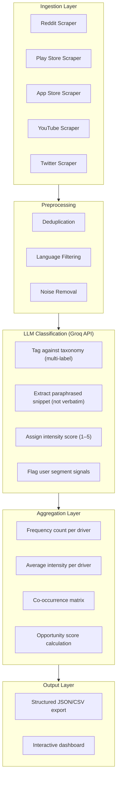
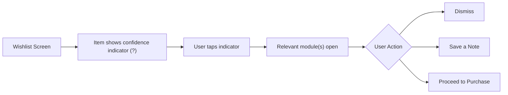

# Problem Statement — Myntra Wishlist-to-Purchase Conversion

> **Fellowship Context:** Product Management case study  
> **Business Goal:** Increase the percentage of Myntra users who purchase at least one wishlisted item within 30 days of adding it  

> [!CAUTION]
> **Hard Constraint:** No monetary incentives (discounts, coupons, cashback) are permitted as part of any solution. The lever must be **information**, **confidence**, or **experience** — not price.

---

## Table of Contents

- [1. Background & Opportunity](#1-background--opportunity)
- [2. Part A — AI-Powered Discovery Engine](#2-part-a--ai-powered-discovery-engine)
  - [2.1 Data Sources](#21-data-sources)
  - [2.2 Classification Taxonomy](#22-classification-taxonomy)
  - [2.3 Pipeline Architecture](#23-pipeline-architecture)
  - [2.4 Interactive / Testable Requirement](#24-interactive--testable-requirement)
  - [2.5 Suggested Tech Stack](#25-suggested-tech-stack)
  - [2.6 Deliverable Output for the Deck](#26-deliverable-output-for-the-deck)
- [3. Part B — MVP: Wishlist Confidence Assistant](#3-part-b--mvp-wishlist-confidence-assistant)
  - [3.1 Hypothesis](#31-hypothesis)
  - [3.2 Core Modules](#32-core-modules)
  - [3.3 User Flow](#33-user-flow)
  - [3.4 Screens to Build](#34-screens-to-build)
  - [3.5 Tech Stack](#35-tech-stack)
  - [3.6 Hard Constraints](#36-hard-constraints)
  - [3.7 Instrumentation](#37-instrumentation)
- [4. Repository Structure](#4-repository-structure)
- [5. Definition of Done](#5-definition-of-done)

---

## 1. Background & Opportunity

Myntra's wishlist feature sees significant engagement — users actively save items for later — but a large share of wishlisted items **never convert to purchase**. The gap between "intent signal" (wishlisting) and "action" (buying) represents a major untapped revenue lever.

This project tackles the conversion gap through **two independent, deployable codebases**:

| Codebase | Purpose | Output |
|---|---|---|
| **Part A — Discovery Engine** | Analyze public conversations at scale to quantify *why* users don't buy wishlisted items | Ranked opportunity areas with evidence |
| **Part B — MVP Prototype** | Build a modular "Wishlist Confidence Assistant" scaffold that addresses the top blockers | Testable, interview-informed product |

> [!IMPORTANT]
> The MVP's final scope must emerge from **5–6 real user interviews** and a formal problem definition — not from assumptions. Part B is an illustrative scaffold designed for modularity: irrelevant modules get stripped, validated ones get deepened.

---

## 2. Part A — AI-Powered Discovery Engine

**Goal:** Analyze public conversations about fashion e-commerce wishlist/purchase behavior at scale, and surface **quantified, ranked opportunity areas** — not just sentiment summaries.

---

### 2.1 Data Sources

| # | Source | Method | Notes |
|---|---|---|---|
| 1 | **Reddit** | Reddit Public API / PRAW | Subreddits: `r/IndianFashionAddicts`, `r/india`, `r/femalefashionadvice`-style subs, general shopping threads |
| 2 | **Google Play Store** | `google-play-scraper` | Myntra app reviews |
| 3 | **Apple App Store** | `app-store-scraper` | Myntra app reviews |
| 4 | **YouTube** | YouTube Data API | Comments on Myntra haul / unboxing / review videos |
| 5 | **Twitter / X** *(if available)* | Public API | Posts mentioning Myntra wishlist, sizing, returns |
| 6 | **Fashion Forums** *(optional stretch)* | Web scraping | IndianFashionAddicts-style boards |

---

### 2.2 Classification Taxonomy

The LLM classifies each scraped snippet against the following **starter taxonomy**. Multi-label classification is allowed, and the model **may propose new categories** if a cluster doesn't fit.

| # | Driver Category | Example Signal |
|---|---|---|
| 1 | **Fit / Size Uncertainty** | "I'm between sizes and don't want to risk it" |
| 2 | **Price / Deal-Timing Uncertainty** | "Waiting for the next sale to buy" |
| 3 | **Styling / Occasion Uncertainty** | "Don't know how to wear it / what to pair it with" |
| 4 | **Trust / Review Credibility Doubt** | "Reviews feel fake, can't trust the quality" |
| 5 | **Comparison Paralysis** | "Saved 10 similar kurtas, can't decide which one" |
| 6 | **Wishlist-as-Bookmark Behavior** | "I save things I'll never buy, just browsing" |
| 7 | **Return / Exchange Friction Fear** | "Returns are such a hassle, not worth the risk" |
| 8 | **Social Validation Seeking** | "Need to ask my friend / post it somewhere first" |
| 9 | **Wishlist Abandonment / Forgetting** | "Forgot I even had things saved" |
| 10 | **External Research Before Purchase** | "Left the app to Google the brand / check other sites" |

---

### 2.3 Pipeline Architecture



#### Classification Layer Details

For each snippet, the Groq API call produces:

| Output Field | Description |
|---|---|
| **Taxonomy Tags** | One or more driver categories from the taxonomy (multi-label) |
| **Paraphrased Snippet** | A short, reworded summary — **not a direct quote** |
| **Intensity Score** | 1–5 scale for how strongly the snippet expresses the driver |
| **Segment Signals** | Inferred user segment flags (e.g., "student," "first-time buyer," "plus-size," "men's fashion") |

#### Opportunity Score Formula

```
Opportunity Score = Frequency × Avg. Intensity × Business-Relevance Weight
```

> [!NOTE]
> The **business-relevance weight** is editable, allowing the team to adjust scoring based on strategic priorities (e.g., weighting "fit uncertainty" higher if sizing is a known pain point).

---

### 2.4 Interactive / Testable Requirement

> [!IMPORTANT]
> This is what makes the deliverable a **"workflow that can be tested"** — not just a static report.

Build a small web app with **two views**:

#### View 1 — Live Classifier Demo

| Aspect | Detail |
|---|---|
| **Input** | A text box where anyone can paste a review or comment |
| **Output** | Real-time classification against the taxonomy, with reasoning shown |
| **Purpose** | Proves the engine works beyond a static report |

#### View 2 — Findings Dashboard

| Component | Description |
|---|---|
| **Driver Frequency Bar Chart** | Visual ranking of how often each driver appears |
| **Co-occurrence Heatmap** | Which drivers tend to appear together |
| **Ranked Opportunity Table** | Driver → frequency → avg intensity → opportunity score → 2–3 example paraphrased snippets |
| **Segment Filter** | Filter results by inferred user segment (if segment data exists) |

---

### 2.5 Suggested Tech Stack

| Layer | Technology | Notes |
|---|---|---|
| **Backend** | Node.js (Express) *or* Python (FastAPI) | Choose based on scraper library availability |
| **LLM** | Groq API (`llama3-70b-8192` or similar) | For classification and paraphrasing |
| **Frontend** | React + Recharts *or* Chart.js | Dashboard visualizations |
| **Storage** | Supabase (PostgreSQL) | Easier for deployment on Vercel |
| **Deployment** | Vercel, Railway, or Replit | **Must be a public URL, no login wall** |

---

### 2.6 Deliverable Output for the Deck

The engine must be able to export a **single ranked table** that can be dropped straight into one presentation slide:

| Driver | Frequency | Avg. Intensity | Opportunity Score | Example Snippets (2–3) |
|---|---|---|---|---|
| *e.g., Fit/Size Uncertainty* | *142* | *4.1* | *87.3* | *"Unsure about sizing…"* |
| … | … | … | … | … |

---

## 3. Part B — MVP: Wishlist Confidence Assistant

> [!WARNING]
> **Status: Illustrative scaffold, not final.** The case study requires the MVP's actual scope to emerge from 5–6 real user interviews (Part 3) and a problem definition (Part 4). Build this as a **modular prototype** so that irrelevant modules can be stripped and validated ones deepened — rather than rebuilding from scratch.

---

### 3.1 Hypothesis

> Different segments stall for different reasons: some are blocked by **fit confidence**, others by **price-timing**, others by **decision paralysis** across similar saved items. The MVP surfaces the **specific blocker per item** rather than treating all wishlist stagnation the same way.

---

### 3.2 Core Modules

Each module is **independently toggleable** — designed to be enabled, disabled, or swapped based on user research findings.

| # | Module | What It Does | Target Blocker |
|---|---|---|---|
| 1 | **Fit Confidence** | Surfaces a predicted fit synthesized from review text (e.g., *"runs small based on reviews from similar body types"*) — not just a size chart | Fit / Size Uncertainty |
| 2 | **Price Context** | Shows recent price history and trend without offering a discount (e.g., *"held steady for 60 days"* / *"typically drops during EOSS"*) — **informational only, no coupon** | Price / Deal-Timing Uncertainty |
| 3 | **Styling Assist** | Generates 2–3 "how to wear this" pairings from the product + wardrobe basics, for occasion-uncertain users | Styling / Occasion Uncertainty |
| 4 | **Comparison Clarity** | When 2+ similar items are wishlisted, surfaces a side-by-side of what actually differs to break decision paralysis | Comparison Paralysis |
| 5 | **Review Digest** | Short synthesized summary of what reviewers with similar concerns actually experienced (fit, quality, true-to-size) | Trust / Review Credibility Doubt |

---

### 3.3 User Flow



> Modules are generated **live** from product data + the review corpus from Part A's output.

---

### 3.4 Screens to Build

| Screen | Description |
|---|---|
| **Wishlist List View** | Existing Myntra-style UI, replicated minimally |
| **Item Detail / Confidence Panel** | The core new surface — opens relevant modules per item |
| **Comparison View** | Side-by-side for Module 4 (Comparison Clarity) |

---

### 3.5 Tech Stack

| Layer | Technology | Notes |
|---|---|---|
| **Frontend** | React / Next.js | Website layout |
| **Backend** | Groq API (same pattern as Discovery Engine) | Uses a mock product catalog (10–20 sample SKUs with realistic fake data) + real review corpus from Part A |
| **Deployment** | Vercel / Replit | **Public URL, no login wall** |

---

### 3.6 Hard Constraints

> [!CAUTION]
> These constraints are **non-negotiable** and must be respected across all modules.

| Constraint | Detail |
|---|---|
| ❌ **No monetary incentives** | No discounts, coupons, cashback, or price-drop nudges framed as incentives |
| ❌ **No dark patterns** | No fake urgency, no fake scarcity |
| ✅ **Information only** | All modules must be informational — building confidence, not manipulating behavior |

---

### 3.7 Instrumentation

> [!TIP]
> Log these events from **day one**, even before real metrics are defined. Part 6 (success metrics) will reference this data.

| Event | Description |
|---|---|
| `module_opened` | Which item triggered a module open |
| `module_type` | Which of the 5 modules was opened |
| `item_purchased` | Item purchased within *N* days of module interaction |
| `item_removed` | Item removed from wishlist after module interaction |

---

## 4. Repository Structure

```
/discovery-engine
  /ingestion           # Scrapers per source (Reddit, Play Store, etc.)
  /classification      # LLM prompts + taxonomy configuration
  /aggregation         # Frequency, intensity, co-occurrence, scoring
  /dashboard           # React app (Live Classifier + Findings Dashboard)
  /api                 # Backend API endpoints

/mvp
  /frontend            # React/Next.js Wishlist Confidence Assistant UI
  /backend             # Groq API integration + mock catalog logic
  /mock-data           # 10–20 sample SKUs with realistic product data
```

---

## 5. Definition of Done

| Criterion | Requirement |
|---|---|
| **Deployment** | Both apps deployed to **public URLs**, no auth wall, loadable on web |
| **Discovery Engine — Classifier** | Live classifier demo works with **arbitrary pasted text** |
| **Discovery Engine — Dashboard** | Dashboard shows real aggregated data from **at least a few hundred scraped snippets** |
| **MVP — Modules** | At least **2 of the 5 modules** fully functional end-to-end on a mock wishlist — **not just static mockups** |

---

*Source: [problemstatement.txt](file:///d:/DRIVE%20F/GRAD%20PROJECT%20NL/docs/problemstatement.txt)*
