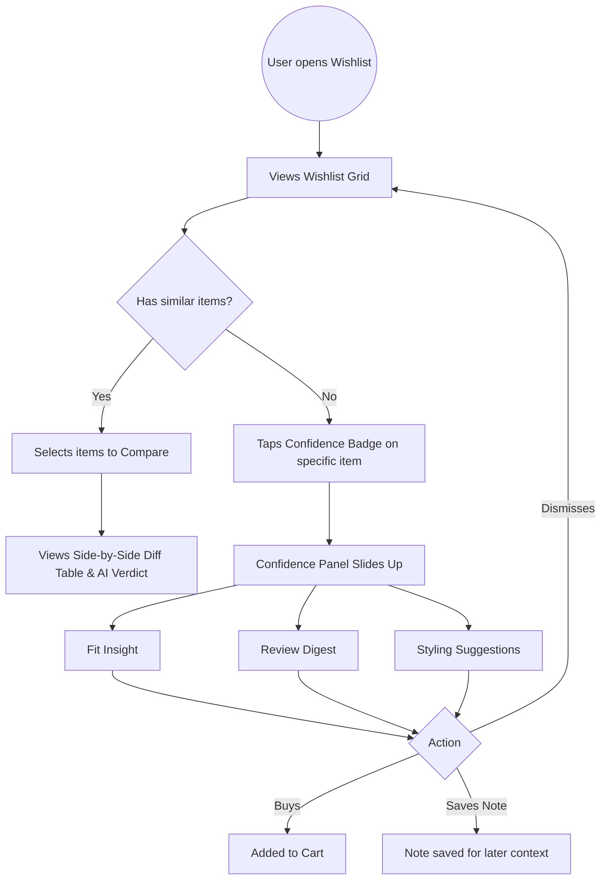

# UI/UX Design System & Layouts
**Project:** Myntra Wishlist-to-Purchase Conversion System  
**Date:** August 2026

This document outlines the user interface components, layout architecture, and user flows for both the **Discovery Engine Dashboard** and the **MVP Wishlist Confidence Assistant**. It reflects the actual deployed interfaces and serves as the definitive reference for the design system.

---

## 1. Design Language & Aesthetics

> [!NOTE]
> The design language across both interfaces diverges from standard bright e-commerce palettes in favor of a sleek, state-of-the-art dark mode aesthetic to emphasize trust, high-tech AI capabilities, and premium user experience.

*   **Color Palette:**
    *   **Primary Brand:** Premium Light Purple (`#d8b4fe`) and Premium Light Blue (`#818cf8`) for gradients and primary actions.
    *   **Confidence Accents:** Neon Pink/Rose glows (`#ffb2ba`) to highlight AI insights and active states.
    *   **Neutrals:** Deep dark backgrounds (`#0f131d`, `#0a0e18`) with glassmorphism overlays for a premium dark mode experience.
*   **Typography:** Modern pairing of **Space Grotesk** (for display and headlines) and **Inter** (for body and labels), replacing standard e-commerce defaults.
*   **Aesthetic Principle:** "Information without Clutter." The interfaces heavily utilize **glassmorphism** (`blur(12px)` to `blur(24px)`), subtle neon glows, and gradient text to elevate AI panels above the standard e-commerce grid, providing a state-of-the-art premium feel.

---

## 2. Part A: Discovery Engine Dashboard

The Discovery Engine is a B2B internal tool meant for Product Managers and Analysts. The design focuses on data density, scannability, and clear visual hierarchy.

### 2.1 Live Classifier View
**Purpose:** A sandbox to test the LLM's classification logic in real-time.

*   **Layout:** Split-screen or centered card design.
*   **Input Zone (`TextInput`):** A large, prominent text area allowing analysts to paste arbitrary user comments or reviews.
*   **Output Zone (`ClassificationResult`):** 
    *   **`TagBadges`:** Pill-shaped tags displaying the identified hesitation drivers (e.g., "Fit / Size Uncertainty").
    *   **`IntensityMeter`:** A visual progress bar or 5-star style indicator showing the intensity of the hesitation (1-5).
    *   **`Paraphrase`:** A quoted block featuring the AI's synthesized, non-verbatim summary.
    *   **`SegmentChips`:** Small labels indicating inferred demographic data (e.g., "first-time buyer").

### 2.2 Findings Dashboard View
**Purpose:** The main analytical surface for presenting aggregated opportunity scores.

*   **Top Navigation:** Tabbed layout for easy switching between views.
*   **Global Controls (`SegmentFilter`):** A sticky top bar with dropdowns to filter the entire dashboard by specific user segments.
*   **Visualizations:**
    *   **`DriverFrequencyChart`:** A horizontal bar chart (via Recharts) displaying the most common blockers.
    *   **`CooccurrenceHeatmap`:** A visually striking N×N grid where color intensity (light blue to deep navy) represents how frequently two drivers appear together in the same review.
*   **Data Grid (`OpportunityTable`):**
    *   A rich, sortable table ranking drivers by their Opportunity Score.
    *   **Expandable Rows (`DriverRow`):** Clicking a row drops down to reveal 2–3 real-world paraphrased snippets, grounding the data in human context.

---

## 3. Part B: MVP Wishlist Confidence Assistant

This is the consumer-facing prototype. It integrates seamlessly into a mock Myntra app environment. 

> [!IMPORTANT]
> The UI strictly adheres to the hard constraints: **No discount banners, no fake urgency timers, and no manipulative popups.**

### 3.1 Wishlist List View
**Purpose:** The standard grid of saved items, enhanced with entry points for the AI assistant.

*   **Grid Layout:** A standard 2-column e-commerce product grid.
*   **Product Cards (`ItemCard`):** Features the product image, brand, name, and current price.
*   **The AI Hook (`ConfidenceBadge`):** 
    *   A subtle, floating icon (like a sparkle `✨` or a question mark `?`) layered over the product image or near the price. 
    *   *Interaction:* Tapping this badge does not add to cart; it slides open the Confidence Panel.

### 3.2 Item Detail & Confidence Panel
**Purpose:** The core surface where AI modules intervene to resolve hesitation.

*   **Base Layer (`ProductInfo`):** Standard product details.
*   **Overlay (`ConfidencePanel`):** A sleek bottom-sheet or side-drawer that slides into view. It houses the dynamically generated modules.
    *   **`FitConfidenceModule`:** A prominent card stating the synthesized fit verdict (e.g., "Runs small for M based on 23 reviews"). Uses a visual slider indicating "Tight - True to Size - Loose".
    *   **`PriceContextModule`:** A simple sparkline chart showing price stability. *Design Rule:* Uses neutral colors (grays) to avoid creating panic or urgency.
    *   **`StylingAssistModule`:** A mini-carousel of 2-3 outfit pairing suggestions.
    *   **`ReviewDigestModule`:** A summarized paragraph of what reviewers experienced, formatted with bullet points for quick scanning.
*   **Action Footer (`ActionButtons`):**
    *   Sticky bottom bar with three clear paths: "Dismiss" (ghost button), "Save Note" (secondary button), and "Proceed to Purchase" (primary accent button).

### 3.3 Comparison View
**Purpose:** Resolves decision paralysis when a user has multiple similar items wishlisted.

*   **Trigger:** Activated when a user selects 2+ items from the Wishlist Grid.
*   **Layout (`ComparisonSidebar` & `DiffTable`):**
    *   A split-screen or swipeable side-by-side view.
    *   Highlights the *differences* rather than listing all specs (e.g., highlights that one is 100% cotton while the other is a blend).
*   **AI Verdict (`AIVerdict`):** A short, conversational summary at the top (e.g., *"Item A is better rated for comfort, while Item B is more suitable for formal occasions."*)

---

## 4. User Interaction Flow Diagram

